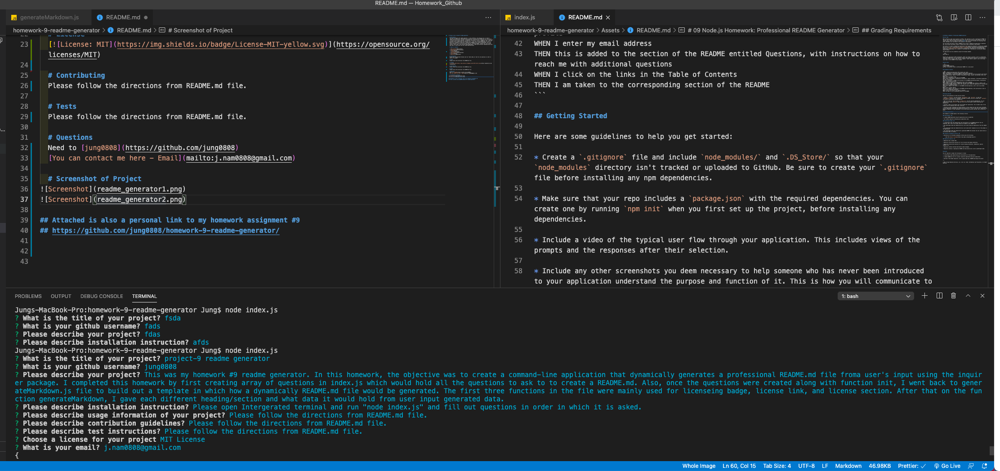
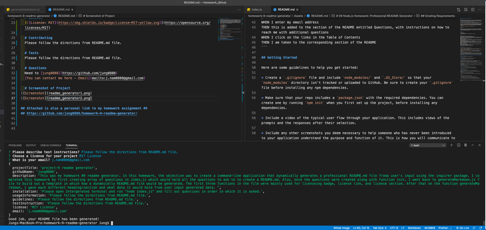

# Project Title: project-9 readme generator

# Description

This was my homework #9 readme generator. In this homework, the objective was to create a command-line application that dynamically generates a professional README file froma user's input using the inquirer package. I completed this homework by first creating array of questions in index.js which would hold all the questions to ask to to create a README. Also, once the questions were created along with function init, I went back to generateMarkdown.js file to build out a template in which how a dynamically README file would be generated. The first three functions in the file were mainly used for licenseing badge, license link, and license section. After that on the function generateMarkdown, I gave each different heading/section and what data it would hold from user input generated data.

# Table of Contents

- [Description](#Description)
- [Installation](#Installation)
- [Usage](#Usage)
- [License](#License)
- [Contributing](#Contributing)
- [Tests](#Tests)
- [Questions](#Questions)

# Installation

Please open Intergerated terminal and run "node index.js" and fill out questions in order in which it is asked.

# Usage

Please follow the directions from README file.

# License

# Contributing

Please follow the directions from README file.

# Tests

Please follow the directions from README file.

# Questions

Need to contact[jung0808?](https://github.com/jung0808)
[You can contact me here - Email](mailto:j.nam0808@gmail.com)

# Screenshot of Project

## Attached is also a personal link to my homework assignment #9

## https://github.com/jung0808/homework-9-readme-generator/

## Video demo of deployed application: https://drive.google.com/file/d/1a6wZONdXB7RshQ_iK1v2RP3TrhwnXczz/view
